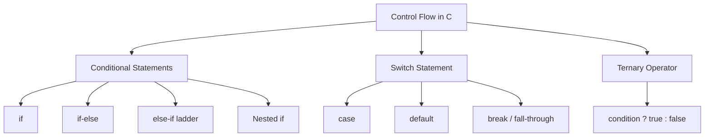

# Control Flow in C 🔀

!!! abstract "What You'll Learn"
    - ✅ What control flow is and why it matters
    - ✅ `if`, `if-else`, and `else-if` ladder
    - ✅ Nested `if` statements
    - ✅ Comparison and logical operators
    - ✅ `switch` statement with fall-through
    - ✅ Ternary operator (`? :`)
    - ✅ Common mistakes to avoid

---

## 📖 Introduction

By default, C executes code **line by line from top to bottom**. But real programs need to make **decisions** — do this if something is true, do that if it's false.

**Control Flow** is about controlling **which path** your program takes based on conditions.

!!! tip "Think of it this way"
    Just like a GPS gives you different routes based on traffic — control flow gives your program different paths based on conditions! 🛣️



---

## 🔢 Conditional Statements

### 1️⃣ The `if` Statement

The simplest decision — **do something only if a condition is true**.

**Syntax**

```c
if (condition) {
    // runs only if condition is TRUE
}
```

**Memory Visualization**

```
     ┌─────────────────────┐
     │     Condition?      │
     └──────────┬──────────┘
                │
        ┌───────┴───────┐
        │               │
      TRUE            FALSE
        │               │
        ▼               ▼
   Run the code      Skip it
        │               │
        └───────┬───────┘
                ▼
         Rest of Program
```

**Basic Usage**

```c
#include <stdio.h>

int main() {
    int age = 18;

    if (age >= 18) {
        printf("✅ You are eligible to vote!\n");
    }

    printf("Program continues...\n");

    return 0;
}
```

**Output:**
```
✅ You are eligible to vote!
Program continues...
```

!!! info "Real-Life Example"
    - Check if a number is positive
    - Check if user is logged in
    - Check if a file exists

!!! tip "What if age was 16?"
    If `age = 16`, the condition `16 >= 18` is **FALSE** — the `printf` inside `if` is completely skipped.

---

### 2️⃣ The `if-else` Statement

Do **one thing** if true, **another thing** if false.

**Syntax**

```c
if (condition) {
    // runs if condition is TRUE
} else {
    // runs if condition is FALSE
}
```

**Memory Visualization**

```
          ┌─────────────────────┐
          │      Condition?     │
          └──────────┬──────────┘
                     │
          ┌──────────┴──────────┐
          │                     │
        TRUE                  FALSE
          │                     │
          ▼                     ▼
    if block runs          else block runs
          │                     │
          └──────────┬──────────┘
                     ▼
              Rest of Program
```

**Basic Usage**

```c
#include <stdio.h>

int main() {
    int marks;

    printf("Enter your marks: ");
    scanf("%d", &marks);

    if (marks >= 50) {
        printf("🎉 Congratulations! You PASSED!\n");
    } else {
        printf("😞 Sorry, you FAILED. Try again!\n");
    }

    return 0;
}
```

**Output:**
```
Enter your marks: 75
🎉 Congratulations! You PASSED!
```

```
Enter your marks: 35
😞 Sorry, you FAILED. Try again!
```

!!! info "Real-Life Example"
    - Login: correct password → welcome, wrong → denied
    - Balance check: enough funds → proceed, not enough → decline
    - Age check: adult → allow entry, minor → restrict

---

### 3️⃣ The `else-if` Ladder

Check **multiple conditions** one by one — like a ladder.

**Syntax**

```c
if (condition1) {
    // runs if condition1 is TRUE
} else if (condition2) {
    // runs if condition2 is TRUE
} else if (condition3) {
    // runs if condition3 is TRUE
} else {
    // runs if NONE of the above are true
}
```

**Memory Visualization**

```
     ┌──────────────────┐
     │   condition 1?   │──TRUE──▶ Run Block 1 → exit
     └────────┬─────────┘
            FALSE
              │
     ┌────────▼─────────┐
     │   condition 2?   │──TRUE──▶ Run Block 2 → exit
     └────────┬─────────┘
            FALSE
              │
     ┌────────▼─────────┐
     │   condition 3?   │──TRUE──▶ Run Block 3 → exit
     └────────┬─────────┘
            FALSE
              │
              ▼
        Run else Block
```

**Practical Example: Grade System**

```c
#include <stdio.h>

int main() {
    int marks;

    printf("Enter your marks (0-100): ");
    scanf("%d", &marks);

    if (marks >= 90) {
        printf("🌟 Grade: A+ — Excellent!\n");
    } else if (marks >= 80) {
        printf("😊 Grade: A  — Very Good!\n");
    } else if (marks >= 70) {
        printf("👍 Grade: B  — Good!\n");
    } else if (marks >= 60) {
        printf("🙂 Grade: C  — Average\n");
    } else if (marks >= 50) {
        printf("😐 Grade: D  — Below Average\n");
    } else {
        printf("😞 Grade: F  — Failed\n");
    }

    return 0;
}
```

**Output:**
```
Enter your marks: 95  →  🌟 Grade: A+ — Excellent!
Enter your marks: 73  →  👍 Grade: B  — Good!
Enter your marks: 42  →  😞 Grade: F  — Failed
```

!!! info "Important Rule"
    Once a condition is **TRUE**, C runs that block and **skips all remaining** `else if` and `else` blocks — even if they would also be true.

---

### 4️⃣ Nested `if` Statements

An `if` statement **inside** another `if` statement.

**Syntax**

```c
if (condition1) {
    if (condition2) {
        // runs if BOTH are true
    } else {
        // runs if only condition1 is true
    }
} else {
    // runs if condition1 is false
}
```

**Practical Example: Login System**

```c
#include <stdio.h>
#include <string.h>

int main() {
    char username[50];
    char password[50];

    printf("Enter username: ");
    scanf("%s", username);

    printf("Enter password: ");
    scanf("%s", password);

    if (strcmp(username, "admin") == 0) {
        if (strcmp(password, "1234") == 0) {
            printf("✅ Login successful! Welcome, Admin!\n");
        } else {
            printf("❌ Wrong password!\n");
        }
    } else {
        printf("❌ Username not found!\n");
    }

    return 0;
}
```

**Output:**
```
Enter username: admin
Enter password: 1234
✅ Login successful! Welcome, Admin!
```

```
Enter username: admin
Enter password: wrong
❌ Wrong password!
```

```
Enter username: guest
Enter password: 1234
❌ Username not found!
```

!!! warning "Don't Over-Nest!"
    More than 3 levels of nesting makes code very hard to read. Use logical operators instead:
    ```c
    // ❌ Hard to read
    if (a) {
        if (b) {
            if (c) { ... }
        }
    }

    // ✅ Better — use && operator
    if (a && b && c) { ... }
    ```

---

## 🔣 Comparison & Logical Operators

Used inside conditions to compare values and combine conditions.

**Comparison Operators**

```
     ┌──────────┬──────────────────────────┬────────────────────┐
     │ Operator │ Meaning                  │ Example            │
     ├──────────┼──────────────────────────┼────────────────────┤
     │   ==     │ Equal to                 │ a == b             │
     │   !=     │ Not equal to             │ a != b             │
     │   >      │ Greater than             │ a > b              │
     │   <      │ Less than                │ a < b              │
     │   >=     │ Greater than or equal to │ a >= b             │
     │   <=     │ Less than or equal to    │ a <= b             │
     └──────────┴──────────────────────────┴────────────────────┘
```

**Logical Operators**

```
     ┌──────────┬──────────────────────────┬──────────────────────────┐
     │ Operator │ Meaning                  │ Example                  │
     ├──────────┼──────────────────────────┼──────────────────────────┤
     │   &&     │ AND — both must be true  │ age > 18 && hasID == 1   │
     │   ||     │ OR  — one must be true   │ isAdmin || isMod         │
     │   !      │ NOT — reverses result    │ !isLoggedIn              │
     └──────────┴──────────────────────────┴──────────────────────────┘
```

**Operators in Action**

=== "&& (AND)"
    ```c
    int age   = 20;
    int hasID = 1;

    if (age >= 18 && hasID == 1) {
        printf("✅ Entry allowed!\n");
    }
    ```
    **Output:**
    ```
    ✅ Entry allowed!
    ```
    Both conditions must be TRUE.

=== "|| (OR)"
    ```c
    int isWeekend = 0;
    int isHoliday = 1;

    if (isWeekend || isHoliday) {
        printf("🎉 Day off!\n");
    }
    ```
    **Output:**
    ```
    🎉 Day off!
    ```
    At least one condition must be TRUE.

=== "! (NOT)"
    ```c
    int isRaining = 0;

    if (!isRaining) {
        printf("☀️ Go outside!\n");
    }
    ```
    **Output:**
    ```
    ☀️ Go outside!
    ```
    Reverses the condition — `!0` becomes TRUE.

!!! warning "Common Mistake — `=` vs `==`"
    ```c
    int x = 5;

    if (x = 10) { ... }   // ❌ WRONG — ASSIGNS 10 to x (always true!)
    if (x == 10) { ... }  // ✅ CORRECT — COMPARES x with 10
    ```
    This is one of the most common bugs in C. Always use `==` for comparison!

---

## 🔀 The `switch` Statement

A cleaner way to handle **multiple fixed values** of a single variable.

**Syntax**

```c
switch (variable) {
    case value1:
        // code for value1
        break;
    case value2:
        // code for value2
        break;
    default:
        // runs if no case matches
}
```

**Memory Visualization**

```
            switch(choice)
                  │
     ┌────────────┼─────────────┐──────────┐
     │            │             │          │
   case 1       case 2        case 3    default
     │            │             │          │
   break        break         break      break
```

**Practical Example: Day of the Week**

```c
#include <stdio.h>

int main() {
    int day;

    printf("Enter day number (1-7): ");
    scanf("%d", &day);

    switch (day) {
        case 1:  printf("📅 Monday\n");              break;
        case 2:  printf("📅 Tuesday\n");             break;
        case 3:  printf("📅 Wednesday\n");           break;
        case 4:  printf("📅 Thursday\n");            break;
        case 5:  printf("📅 Friday\n");              break;
        case 6:  printf("🎉 Saturday — Weekend!\n"); break;
        case 7:  printf("🎉 Sunday — Weekend!\n");   break;
        default: printf("❌ Invalid! Enter 1-7\n");
    }

    return 0;
}
```

**Output:**
```
Enter day number: 1  →  📅 Monday
Enter day number: 6  →  🎉 Saturday — Weekend!
Enter day number: 9  →  ❌ Invalid! Enter 1-7
```

**Fall-Through (Grouping Cases)**

=== "With break"
    ```c
    switch (day) {
        case 1:
            printf("Monday\n");
            break;   // stops here
        case 2:
            printf("Tuesday\n");
            break;
    }
    ```
    Each case runs independently.

=== "Without break (Fall-Through)"
    ```c
    switch (day) {
        case 1:
        case 2:
        case 3:
        case 4:
        case 5:
            printf("💼 Weekday!\n");
            break;
        case 6:
        case 7:
            printf("🎉 Weekend!\n");
            break;
    }
    ```
    **Output:**
    ```
    Enter day: 3  →  💼 Weekday!
    Enter day: 7  →  🎉 Weekend!
    ```
    Cases 1-5 all fall through to the same output.

**switch vs if-else — When to Use Which?**

| Use `switch` when | Use `if-else` when |
|-------------------|--------------------|
| Checking one variable | Checking ranges (`marks >= 90`) |
| Against fixed exact values | Multiple variables combined |
| Menu choices, day numbers | Float/string comparisons |
| Many exact values | Complex logical conditions |

!!! warning "Always use `break`!"
    Forgetting `break` causes unintended fall-through:
    ```c
    switch (x) {
        case 1:
            printf("One\n");
            // ❌ Missing break — falls into case 2!
        case 2:
            printf("Two\n");  // Also runs when x=1!
            break;
    }
    ```

---

## ⚡ Ternary Operator (`? :`)

A **short one-line** version of `if-else`.

**Syntax**

```c
variable = (condition) ? value_if_true : value_if_false;
```

**Memory Visualization**

```
  condition  ?  value_if_true  :  value_if_false
      │               │                  │
  Is it true?     Use this           Use this
                   if YES             if NO
```

**Ternary Variants**

=== "Basic Usage"
    ```c
    int age    = 20;
    char *status = (age >= 18) ? "Adult" : "Minor";

    printf("Status: %s\n", status);
    ```
    **Output:**
    ```
    Status: Adult
    ```

=== "Find Maximum"
    ```c
    int a = 15, b = 20;
    int max = (a > b) ? a : b;

    printf("Max: %d\n", max);
    ```
    **Output:**
    ```
    Max: 20
    ```

=== "Even or Odd"
    ```c
    int num = 7;
    printf("%d is %s\n", num, (num % 2 == 0) ? "Even" : "Odd");
    ```
    **Output:**
    ```
    7 is Odd
    ```

=== "Inside printf"
    ```c
    int score = 85;
    printf("Result: %s\n", (score >= 50) ? "PASS ✅" : "FAIL ❌");
    ```
    **Output:**
    ```
    Result: PASS ✅
    ```

!!! tip "When to use ternary?"
    Use it for **simple, short** conditions only. If the logic is complex, use `if-else`:
    ```c
    // ✅ Good — simple and clear
    int max = (a > b) ? a : b;

    // ❌ Bad — too complex, hard to read
    int r = (a > b) ? (a > c ? a : c) : (b > c ? b : c);
    ```

---

## 🧠 Full Practical Example — ATM System

```c
#include <stdio.h>

int main() {
    int   pin;
    float balance = 10000.00;
    float amount;
    int   choice;

    printf("╔══════════════════════════════╗\n");
    printf("║         ATM MACHINE          ║\n");
    printf("╚══════════════════════════════╝\n\n");

    // ── PIN Verification ────────────────────
    printf("Enter your PIN: ");
    scanf("%d", &pin);

    if (pin != 1234) {
        printf("❌ Wrong PIN! Access denied.\n");
        return 1;
    }

    printf("✅ PIN correct! Welcome!\n\n");

    // ── Menu ────────────────────────────────
    printf("1. Check Balance\n");
    printf("2. Withdraw\n");
    printf("3. Deposit\n");
    printf("Choice: ");
    scanf("%d", &choice);

    switch (choice) {
        case 1:
            printf("\n💰 Your balance: ₹%.2f\n", balance);
            break;

        case 2:
            printf("Enter amount to withdraw: ₹");
            scanf("%f", &amount);

            if (amount <= 0) {
                printf("❌ Invalid amount!\n");
            } else if (amount > balance) {
                printf("❌ Insufficient balance!\n");
            } else if (amount > 20000) {
                printf("❌ Exceeds daily limit of ₹20,000!\n");
            } else {
                balance -= amount;
                printf("✅ ₹%.2f withdrawn!\n", amount);
                printf("💰 Remaining: ₹%.2f\n", balance);
            }
            break;

        case 3:
            printf("Enter amount to deposit: ₹");
            scanf("%f", &amount);

            if (amount <= 0) {
                printf("❌ Invalid amount!\n");
            } else {
                balance += amount;
                printf("✅ ₹%.2f deposited!\n", amount);
                printf("💰 New balance: ₹%.2f\n", balance);
            }
            break;

        default:
            printf("❌ Invalid choice!\n");
    }

    printf("\nThank you for using our ATM! 👋\n");
    return 0;
}
```

**Output:**
```
╔══════════════════════════════╗
║         ATM MACHINE          ║
╚══════════════════════════════╝

Enter your PIN: 1234
✅ PIN correct! Welcome!

1. Check Balance
2. Withdraw
3. Deposit
Choice: 2
Enter amount to withdraw: ₹5000
✅ ₹5000.00 withdrawn!
💰 Remaining: ₹5000.00

Thank you for using our ATM! 👋
```

---

## ⚠️ Common Mistakes

### 1. Using `=` instead of `==`
```c
if (x = 5)   // ❌ Assigns 5 to x — always TRUE!
if (x == 5)  // ✅ Compares x with 5
```

### 2. Missing curly braces `{}`
```c
// ❌ Only first line is inside if!
if (x > 0)
    printf("Positive\n");
    printf("This always runs!\n");  // NOT inside if!

// ✅ Always use braces
if (x > 0) {
    printf("Positive\n");
    printf("This is inside if\n");
}
```

### 3. Missing `break` in switch
```c
// ❌ Falls through to case 2!
switch (x) {
    case 1:
        printf("One\n");
    case 2:
        printf("Two\n");
        break;
}

// ✅ Always add break
switch (x) {
    case 1:
        printf("One\n");
        break;
    case 2:
        printf("Two\n");
        break;
}
```

### 4. Comparing floats with `==`
```c
float f = 0.1 + 0.2;

if (f == 0.3)              // ❌ May never be true due to precision!
if (f - 0.3 < 0.0001)     // ✅ Use a small tolerance instead
```

### 5. Semicolon after `if`
```c
if (x > 0);               // ❌ Semicolon ends the if immediately!
{
    printf("Positive\n"); // This ALWAYS runs!
}

if (x > 0)                // ✅ No semicolon
{
    printf("Positive\n");
}
```

---

## ✅ Quick Reference Summary

| Statement | Use Case | Example |
|-----------|----------|---------|
| `if` | One condition | `if (age >= 18)` |
| `if-else` | Two outcomes | `if (pass) ... else ...` |
| `else-if` | Multiple ranges | Grade A/B/C/D/F |
| Nested `if` | Conditions inside conditions | Login system |
| `switch` | One variable, many fixed values | Menu, day names |
| Ternary `?:` | Short one-line if-else | `max = a>b ? a : b` |

---

!!! success "You Can Now Control Your Program's Flow! 🎉"
    You know how to make your C programs smart — they can now make decisions, handle multiple cases, and respond differently based on conditions and user input. Practice these well!

!!! tip "Next Topic"
    Now that you can make decisions, learn how to **repeat** things → **[Loops](Loops.md)**