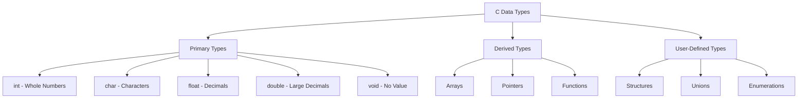
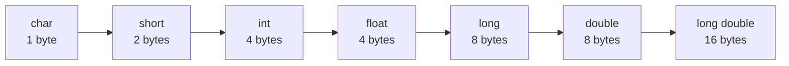
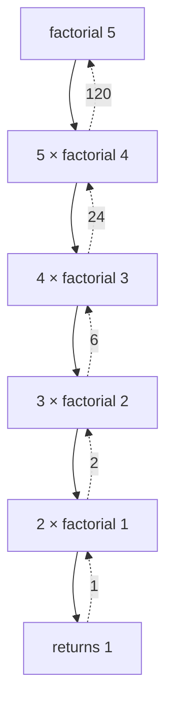

# Data Types 📚

!!! abstract "What You'll Learn"
    - ✅ All C data types with examples
    - ✅ Memory allocation and sizes
    - ✅ Type conversion and casting
    - ✅ Practical applications
    - ✅ Common mistakes to avoid

---

## 📖 Introduction

Data types are the foundation of C programming. They tell the compiler what type of data a variable can store and how much memory to allocate.

!!! tip "Think of it this way"
    Just like you have different containers for different things (bottles for water, boxes for books), C has different data types for different kinds of information! 🎯



---

## 🔢 Primary Data Types

### 1️⃣ Integer Type (`int`)

Stores whole numbers (no decimals).

!!! info "Real-Life Example"
    - Age of a person: `25`
    - Number of students: `50`
    - Year: `2024`

**Basic Usage**

```c
#include <stdio.h>

int main() {
    int age = 25;
    int students = 50;
    int year = 2024;

    printf("Age: %d years\n", age);
    printf("Students: %d\n", students);
    printf("Year: %d\n", year);

    return 0;
}
```

**Output:**
```
Age: 25 years
Students: 50
Year: 2024
```

**Integer Variants**

=== "short int"
    ```c
    short int population = 30000;
    printf("Population: %hd\n", population);
    ```
    - Size: 2 bytes
    - Range: -32,768 to 32,767
    - Use when: You need smaller numbers

=== "int"
    ```c
    int salary = 50000;
    printf("Salary: %d\n", salary);
    ```
    - Size: 4 bytes
    - Range: -2,147,483,648 to 2,147,483,647
    - Use when: Standard integer operations

=== "long int"
    ```c
    long int distance = 384400000L; // Earth to Moon in meters
    printf("Distance: %ld meters\n", distance);
    ```
    - Size: 8 bytes
    - Range: Very large numbers
    - Use when: You need huge numbers

=== "unsigned int"
    ```c
    unsigned int score = 1000000;
    printf("Score: %u\n", score);
    ```
    - Size: 4 bytes
    - Range: 0 to 4,294,967,295 (only positive)
    - Use when: You only need positive numbers

**Memory Visualization**

```
Memory Layout of int (4 bytes = 32 bits)

int age = 25;

┌─────────┬─────────┬─────────┬─────────┐
│ Byte 1  │ Byte 2  │ Byte 3  │ Byte 4  │
├─────────┼─────────┼─────────┼─────────┤
│00000000 │00000000 │00000000 │00011001 │ = 25 in binary
└─────────┴─────────┴─────────┴─────────┘
     ↑                              ↑
Most Significant Byte    Least Significant Byte
```

**Practical Example: Calculator**

```c
#include <stdio.h>

int main() {
    int num1, num2;
    int sum, difference, product, quotient;

    printf("Enter first number: ");
    scanf("%d", &num1);

    printf("Enter second number: ");
    scanf("%d", &num2);

    sum        = num1 + num2;
    difference = num1 - num2;
    product    = num1 * num2;
    quotient   = num1 / num2;

    printf("\n📊 Results:\n");
    printf("Sum:        %d\n", sum);
    printf("Difference: %d\n", difference);
    printf("Product:    %d\n", product);
    printf("Quotient:   %d\n", quotient);

    return 0;
}
```

!!! warning "Common Mistake"
    ```c
    int a = 10;
    int b = 3;
    int result = a / b;  // result = 3 (not 3.33!)
    ```
    Integer division truncates the decimal part!

---

### 2️⃣ Character Type (`char`)

Stores single characters.

!!! info "Real-Life Example"
    - Grade: `'A'`
    - Gender: `'M'` or `'F'`
    - Choice: `'Y'` or `'N'`

**Basic Usage**

```c
#include <stdio.h>

int main() {
    char grade  = 'A';
    char gender = 'M';
    char choice = 'Y';

    printf("Grade: %c\n", grade);
    printf("Gender: %c\n", gender);
    printf("Choice: %c\n", choice);

    // Characters are actually stored as numbers (ASCII)
    printf("\nASCII value of 'A': %d\n", grade);

    return 0;
}
```

**Output:**
```
Grade: A
Gender: M
Choice: Y

ASCII value of 'A': 65
```

**ASCII Table (Common Characters)**

| Character | ASCII Value | Character | ASCII Value |
|-----------|-------------|-----------|-------------|
| `'0'`     | 48          | `'a'`     | 97          |
| `'1'`     | 49          | `'b'`     | 98          |
| `'9'`     | 57          | `'z'`     | 122         |
| `'A'`     | 65          | `' '` (space) | 32      |
| `'B'`     | 66          | `'\n'` (newline) | 10   |
| `'Z'`     | 90          | `'\0'` (null) | 0       |

**Memory Visualization**

```
Memory Layout of char (1 byte = 8 bits)

char grade = 'A';

┌──────────┐
│ 01000001 │ = 65 (ASCII value of 'A')
└──────────┘
  1 byte
```

**Character Operations**

```c
#include <stdio.h>

int main() {
    char letter = 'A';

    printf("Original: %c\n", letter);

    // Convert to lowercase (add 32 to ASCII)
    letter = letter + 32;
    printf("Lowercase: %c\n", letter);

    // Convert back to uppercase (subtract 32)
    letter = letter - 32;
    printf("Uppercase: %c\n", letter);

    // Next letter in alphabet
    letter = letter + 1;
    printf("Next letter: %c\n", letter);

    return 0;
}
```

**Output:**
```
Original: A
Lowercase: a
Uppercase: A
Next letter: B
```

**Practical Example: Grade System**

```c
#include <stdio.h>

int main() {
    char grade;

    printf("Enter your grade (A/B/C/D/F): ");
    scanf(" %c", &grade);

    switch(grade) {
        case 'A': case 'a':
            printf("🌟 Excellent! (90-100)\n"); break;
        case 'B': case 'b':
            printf("👍 Good! (80-89)\n"); break;
        case 'C': case 'c':
            printf("😊 Average (70-79)\n"); break;
        case 'D': case 'd':
            printf("😐 Below Average (60-69)\n"); break;
        case 'F': case 'f':
            printf("😞 Fail (Below 60)\n"); break;
        default:
            printf("❌ Invalid grade!\n");
    }

    return 0;
}
```

!!! tip "Character vs String"
    - `'A'` is a **character** (single quotes)
    - `"A"` is a **string** (double quotes) — array of characters

---

### 3️⃣ Floating Point Type (`float`)

Stores decimal numbers with ~6-7 decimal places precision.

!!! info "Real-Life Example"
    - Temperature: `98.6°F`
    - Price: `$19.99`
    - Distance: `5.8 km`

**Basic Usage**

```c
#include <stdio.h>

int main() {
    float temperature = 98.6;
    float price       = 19.99;
    float distance    = 5.8;

    printf("Temperature: %.1f°F\n", temperature);
    printf("Price: $%.2f\n", price);
    printf("Distance: %.1f km\n", distance);

    return 0;
}
```

**Format Specifiers**

| Specifier | Output            | Example        |
|-----------|-------------------|----------------|
| `%f`      | Default (6 decimals) | `3.140000`  |
| `%.2f`    | 2 decimal places  | `3.14`         |
| `%.0f`    | No decimals       | `3`            |
| `%e`      | Scientific notation | `3.140000e+00` |

**Memory Visualization**

```
Memory Layout of float (4 bytes = 32 bits)

float pi = 3.14;

┌──────┬──────────┬───────────────────────┐
│ Sign │ Exponent │       Mantissa        │
├──────┼──────────┼───────────────────────┤
│ 1bit │  8 bits  │        23 bits        │
└──────┴──────────┴───────────────────────┘
  ↑         ↑               ↑
+/- sign  Power of 2   Fractional part
```

!!! warning "Precision Limitation"
    ```c
    float a = 0.1;
    float b = 0.2;
    float sum = a + b;
    printf("%.20f\n", sum); // 0.30000001192092895508
    ```
    Floating point numbers have precision limits!

---

### 4️⃣ Double Precision Type (`double`)

Stores decimal numbers with ~15-16 decimal places precision.

!!! info "When to Use Double"
    - Scientific calculations
    - Financial applications
    - When you need high precision
    - Large decimal numbers

**Float vs Double Comparison**

=== "float (Single Precision)"
    ```c
    float pi = 3.141592653589793;
    printf("Float: %.15f\n", pi);
    // Output: 3.141592741012573
    ```
    - Size: 4 bytes | Precision: ~6-7 digits | Range: ±3.4 × 10³⁸

=== "double (Double Precision)"
    ```c
    double pi = 3.141592653589793;
    printf("Double: %.15lf\n", pi);
    // Output: 3.141592653589793
    ```
    - Size: 8 bytes | Precision: ~15-16 digits | Range: ±1.7 × 10³⁰⁸

=== "long double"
    ```c
    long double pi = 3.141592653589793238L;
    printf("Long: %.18Lf\n", pi);
    ```
    - Size: 16 bytes | Precision: ~19 digits | Range: Largest

**Practical Example: Circle Calculator**

```c
#include <stdio.h>
#include <math.h>

int main() {
    double radius, area, circumference;
    const double PI = 3.141592653589793;

    printf("Enter circle radius: ");
    scanf("%lf", &radius);

    area          = PI * radius * radius;
    circumference = 2 * PI * radius;

    printf("\n🔵 Circle Properties:\n");
    printf("Radius:        %.2lf units\n", radius);
    printf("Area:          %.2lf square units\n", area);
    printf("Circumference: %.2lf units\n", circumference);

    return 0;
}
```

!!! tip "Rule of Thumb"
    - Use `float` for graphics/games (speed matters)
    - Use `double` for scientific/financial calculations (precision matters)

---

### 5️⃣ Void Type (`void`)

Represents "no type" or "no value".

!!! info "Three Main Uses"
    1. Functions that don't return a value
    2. Functions with no parameters
    3. Generic pointers

**Use Case 1: Functions with No Return**

```c
#include <stdio.h>

void greet() {
    printf("Hello, World! 👋\n");
}

void printLine() {
    printf("═══════════════════════\n");
}

int main() {
    printLine();
    greet();
    printLine();
    return 0;
}
```

**Use Case 2: Generic Pointers**

```c
#include <stdio.h>

int main() {
    int   num  = 10;
    float fnum = 3.14;

    void *ptr;  // Generic pointer

    ptr = &num;
    printf("Integer: %d\n", *(int*)ptr);

    ptr = &fnum;
    printf("Float: %.2f\n", *(float*)ptr);

    return 0;
}
```

!!! warning "Important"
    You cannot create a variable of type void:
    ```c
    void x;  // ❌ ERROR!
    ```

---

## 📊 Complete Size and Range Table

```c
#include <stdio.h>
#include <limits.h>
#include <float.h>

int main() {
    printf("%-20s %-10s %s\n", "Data Type", "Size", "Range");
    printf("%-20s %-10s %s\n", "─────────────────", "────────", "──────────────────────");
    printf("%-20s %-10lu %d to %d\n",    "char",           sizeof(char),           CHAR_MIN,  CHAR_MAX);
    printf("%-20s %-10lu %d to %d\n",    "unsigned char",  sizeof(unsigned char),  0,         UCHAR_MAX);
    printf("%-20s %-10lu %d to %d\n",    "short int",      sizeof(short),          SHRT_MIN,  SHRT_MAX);
    printf("%-20s %-10lu %d to %d\n",    "int",            sizeof(int),            INT_MIN,   INT_MAX);
    printf("%-20s %-10lu %u\n",          "unsigned int",   sizeof(unsigned int),   UINT_MAX);
    printf("%-20s %-10lu Very large\n",  "long int",       sizeof(long));
    printf("%-20s %-10lu %.2e to %.2e\n","float",          sizeof(float),          FLT_MIN,   FLT_MAX);
    printf("%-20s %-10lu %.2e to %.2e\n","double",         sizeof(double),         DBL_MIN,   DBL_MAX);
    return 0;
}
```

**Visual Size Comparison**



---

## 🎯 Derived Data Types

### 1️⃣ Arrays

Collection of elements of the same type stored in contiguous memory.

**Memory Layout**

```
int marks[5] = {85, 90, 78, 92, 88};

Index:   [0]   [1]   [2]   [3]   [4]
       ┌─────┬─────┬─────┬─────┬─────┐
Value: │ 85  │ 90  │ 78  │ 92  │ 88  │
       └─────┴─────┴─────┴─────┴─────┘
Addr:  1000  1004  1008  1012  1016

Total Memory: 5 × 4 = 20 bytes
```

**Single-Dimensional Array**

```c
#include <stdio.h>

int main() {
    int marks[5] = {85, 90, 78, 92, 88};

    printf("📊 Student Marks:\n");
    printf("─────────────────\n");

    for(int i = 0; i < 5; i++) {
        printf("Subject %d: %d\n", i+1, marks[i]);
    }

    int sum = 0;
    for(int i = 0; i < 5; i++) sum += marks[i];
    float average = sum / 5.0;

    printf("─────────────────\n");
    printf("Average: %.2f\n", average);

    return 0;
}
```

**Multi-Dimensional Array**

```c
#include <stdio.h>

int main() {
    int matrix[3][3] = {
        {1, 2, 3},
        {4, 5, 6},
        {7, 8, 9}
    };

    printf("📐 Matrix:\n");
    for(int i = 0; i < 3; i++) {
        for(int j = 0; j < 3; j++) {
            printf("%d ", matrix[i][j]);
        }
        printf("\n");
    }
    return 0;
}
```

!!! warning "Array Index"
    Arrays start at index `0`, not `1`!
    ```c
    int arr[5];
    // Valid:   arr[0], arr[1], arr[2], arr[3], arr[4]
    // Invalid: arr[5]  ❌ (out of bounds!)
    ```

---

### 2️⃣ Pointers

Variables that store memory addresses.

!!! info "Why Pointers?"
    - Dynamic memory allocation
    - Efficient array/string handling
    - Pass by reference
    - Data structures (linked lists, trees)

**Basic Pointer Concepts**

```c
#include <stdio.h>

int main() {
    int num  = 42;
    int *ptr = &num;  // Store address of num

    printf("Value of num:      %d\n",   num);
    printf("Address of num:    %p\n",   (void*)&num);
    printf("Value of ptr:      %p\n",   (void*)ptr);
    printf("Value at address:  %d\n",   *ptr);

    // Modify through pointer
    *ptr = 100;
    printf("\nAfter *ptr = 100:\n");
    printf("Value of num:      %d\n", num);

    return 0;
}
```

**Visual Representation**

```
    num              ptr
  ┌─────┐          ┌──────┐
  │ 42  │          │ 1000 │ ──── points to num
  └─────┘          └──────┘
  Addr: 1000       Addr: 2000

& (address-of): &num  → returns 1000
* (dereference): *ptr → returns value at address (42)
```

**Practical Example: Swap with Pointers**

=== "Without Pointers ❌"
    ```c
    void swap(int a, int b) {
        int temp = a;
        a = b;
        b = temp;
    }
    // Output: x=10, y=20 (NOT swapped!)
    ```

=== "With Pointers ✅"
    ```c
    void swap(int *a, int *b) {
        int temp = *a;
        *a = *b;
        *b = temp;
    }
    // Output: x=20, y=10 (swapped!)
    ```

!!! tip "Pointer Best Practices"
    ```c
    int *ptr = NULL;     // Always initialize to NULL

    if(ptr != NULL) {    // Always check before use
        // Safe to use ptr
    }
    ```

---

### 3️⃣ Functions

Reusable blocks of code that perform specific tasks.

**Function Types**

=== "No Params, No Return"
    ```c
    void greet(void) {
        printf("Hello!\n");
    }
    ```

=== "With Params, No Return"
    ```c
    void printSquare(int num) {
        printf("%d² = %d\n", num, num*num);
    }
    ```

=== "No Params, With Return"
    ```c
    int getNumber(void) {
        return 42;
    }
    ```

=== "With Params and Return"
    ```c
    int multiply(int a, int b) {
        return a * b;
    }
    ```

**Recursion Example: Factorial**

```c
#include <stdio.h>

int factorial(int n) {
    if(n == 0 || n == 1) return 1;     // Base case
    return n * factorial(n - 1);       // Recursive case
}

int main() {
    printf("5! = %d\n", factorial(5)); // Output: 120
    return 0;
}
```



---

## 🧠 User-Defined Data Types

### Structures (`struct`)

Groups different data types under one name.

```c
#include <stdio.h>
#include <string.h>

struct Student {
    char name[50];
    int  age;
    float gpa;
};

int main() {
    struct Student s1;
    strcpy(s1.name, "Alice");
    s1.age = 20;
    s1.gpa = 3.8;

    printf("Name: %s\n",  s1.name);
    printf("Age:  %d\n",  s1.age);
    printf("GPA:  %.1f\n", s1.gpa);

    return 0;
}
```

### Unions

Like structs but all members share the same memory.

```c
union Data {
    int   i;
    float f;
    char  str[20];
};
// All members share the same memory location
```

### Enumerations (`enum`)

Assigns names to integer constants.

```c
enum Day { MON=1, TUE, WED, THU, FRI, SAT, SUN };

int main() {
    enum Day today = WED;
    printf("Day number: %d\n", today); // Output: 3
    return 0;
}
```

---

## 🔄 Type Conversion

### Implicit (Automatic)

```c
int   i = 10;
float f = i;    // int → float automatically
printf("%f\n", f); // 10.000000
```

### Explicit (Casting)

```c
float pi     = 3.14159;
int   approx = (int)pi;   // Explicit cast: float → int
printf("%d\n", approx);   // Output: 3
```

!!! warning "Data Loss in Casting"
    ```c
    float f = 9.99;
    int   i = (int)f;  // i = 9 (decimal part lost!)
    ```

---

## ✅ Quick Reference Summary

| Type        | Size    | Format | Example Value     |
|-------------|---------|--------|-------------------|
| `char`      | 1 byte  | `%c`   | `'A'`             |
| `int`       | 4 bytes | `%d`   | `42`              |
| `float`     | 4 bytes | `%f`   | `3.14`            |
| `double`    | 8 bytes | `%lf`  | `3.141592653589`  |
| `long`      | 8 bytes | `%ld`  | `1234567890L`     |
| `short`     | 2 bytes | `%hd`  | `32767`           |
| `unsigned`  | 4 bytes | `%u`   | `4294967295`      |